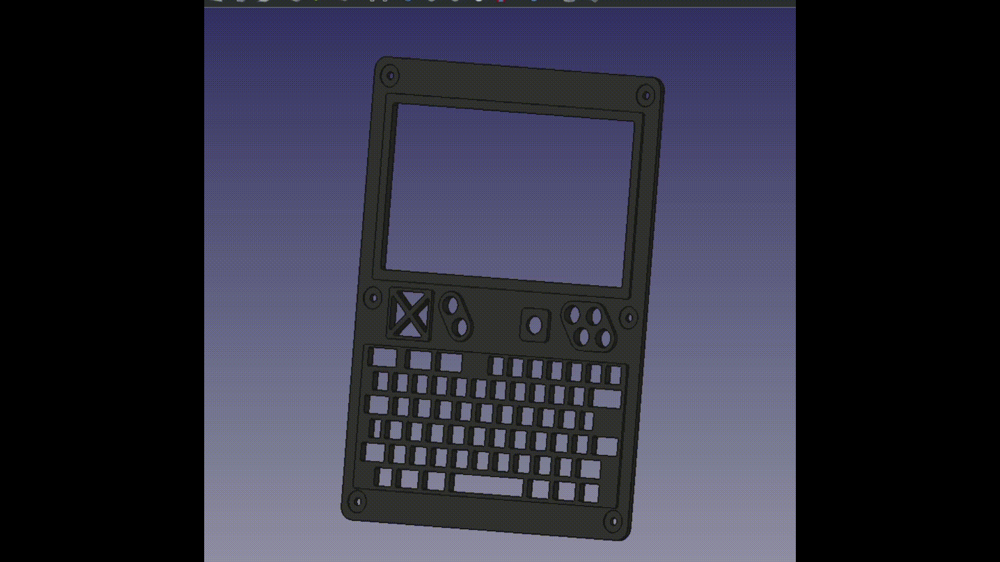
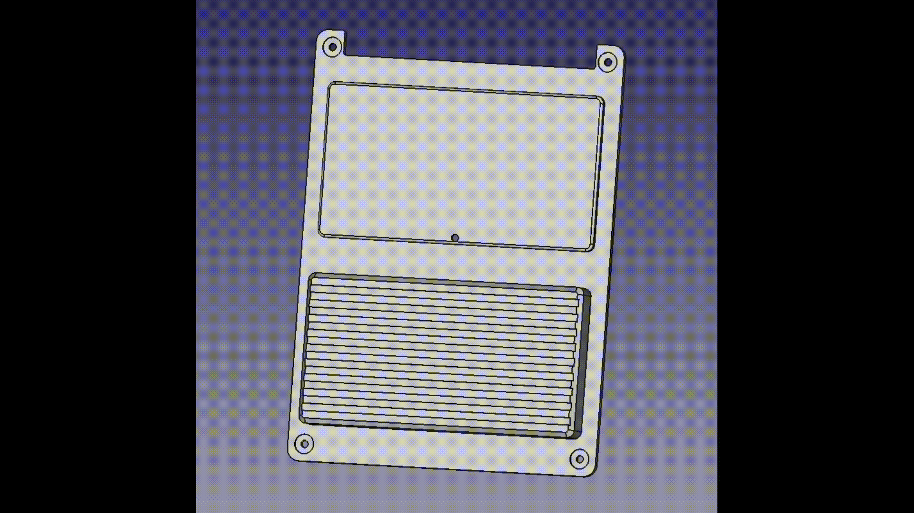

# UPDATE - CPI released formal models on their site

https://www.clockworkpi.com/product-page/uconsole-3d-models-in-obj-format-free

You should use CPI's models moving forward. I'm sure they're spot on. 

------------------------------------------------------------------------------

# uConsole 3D models

This is a repo to host very coarse 3D models for the uConsole made with FreeCAD.

They should be good enough for use as templates to make fixtures and mods for the device. 

**If you need tight tolerances, don't use these models.**

For more info on the actual uConsole, checkout CPI's website and grab one: https://www.clockworkpi.com/uconsole

## Assembly

## Enclosure Top

## Enclosure Body

## Enclosure Bottom

## Keypad

