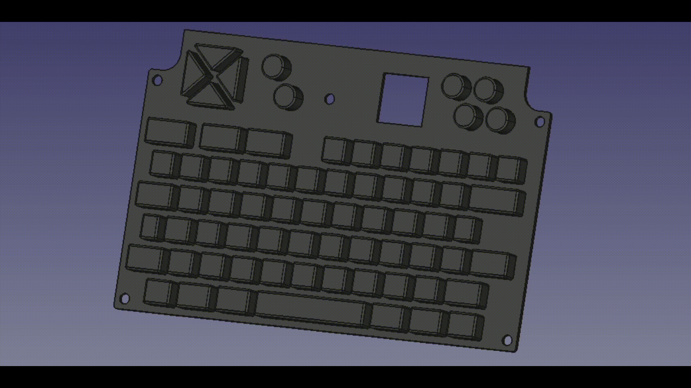

# uConsole 3D models

This is a repo to host very coarse 3D models for the uConsole made with FreeCAD.

They should be good enough for use as templates to make fixtures and mods for the device. 

**If you need tight tolerances, don't use these models.**

## Enclosure Body

## Keypad

